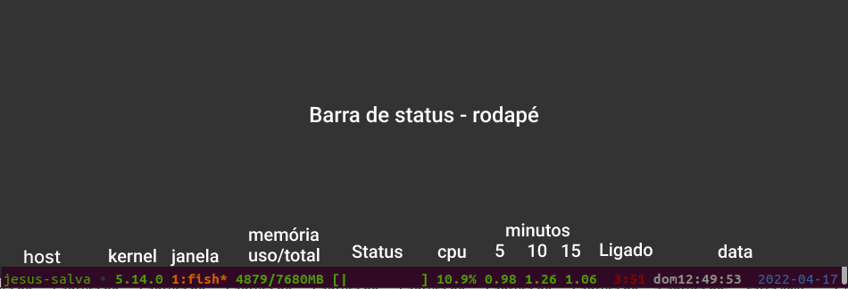
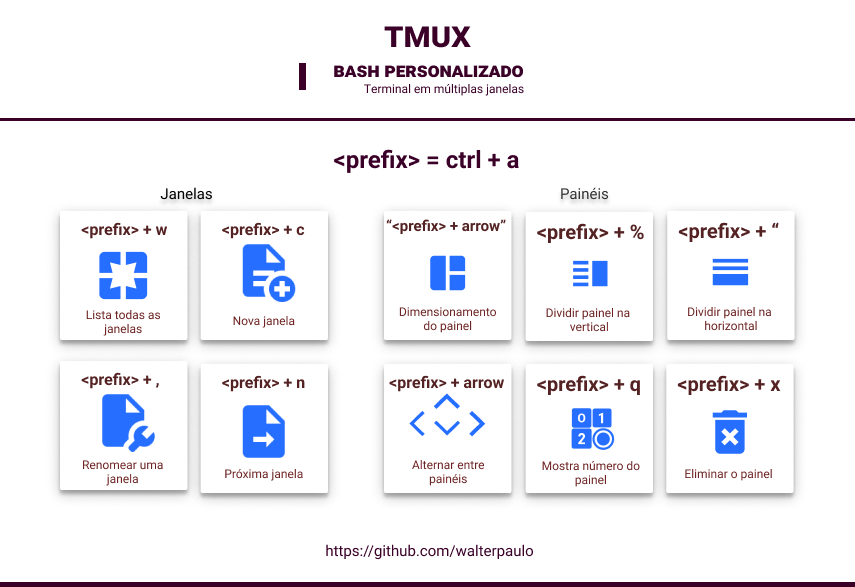

## Personalizar o Shell/Bash com Tmux

* tmux;
* Debian e derivados;

```
git clone https://github.com/walterpaulo/tmux-personalizado.git
cd tmux-personalizado
./install.sh
```

[](https://youtu.be/1GJq5QJzjuM)

```
tmux
```
Pronto!

[](./README.md)


### Material de apoio

* Thewtex -> [https://github.com/thewtex/tmux-mem-cpu-load](https://github.com/thewtex/tmux-mem-cpu-load)
* Tony -> [https://github.com/tony/tmux-config](https://github.com/tony/tmux-config)